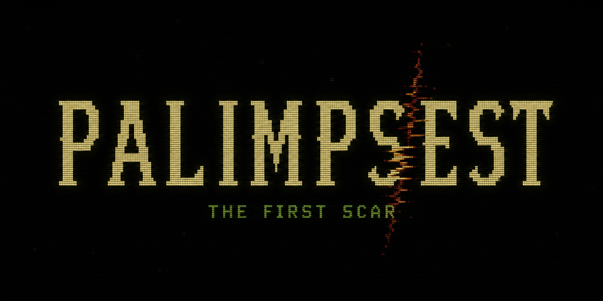

# PALIMPSEST: The First Patch



You just stumbled into a fever dream.

Welcome.

There is a clearing. There are apples. Ordinary things open inward if you know
where to press. Learn their names. Leave a Scar. Break the Universe. Or don't.
Whatever. It was already doing something before you arrived.

PALIMPSEST is a tiny deterministic survival RPG written in C17. It remembers
what you changed and what you learned. Right now, one apple can become unlike
every other apple, and an unnamed weight can follow you home.

That is currently the least alarming thing it can do.

Somewhere beyond the clearing, places remember edits you did not make.

Under the bad idea is raylib 6.0, a 720x405 presentation canvas at exact 2x
scale, deliberately coarse simulation coordinates, and primitive generated
artwork. There are no runtime downloads or online services.

## Build and test

Requirements:

- CMake 3.24 or newer
- A C17 compiler
- Git or HTTPS access during the first configure so CMake can fetch the pinned
  raylib 6.0 source archive

From the repository root:

```powershell
cmake -S . -B build -DCMAKE_BUILD_TYPE=Release
cmake --build build --config Release
ctest --test-dir build --output-on-failure -C Release
```

With a single-config generator, the executable is `build/bin/palimpest.exe`.
A Visual Studio generator may place it below `build/bin/Release/`.

Create a self-contained release directory with:

```powershell
cmake --install build --prefix dist/PALIMPSEST-0.3.0 --config Release --component Palimpest
```

## Run

```powershell
build/bin/palimpest.exe
build/bin/palimpest.exe --new --seed 42
build/bin/palimpest.exe --new --seed 0x5eed --save C:\saves\test.pal
build/bin/palimpest.exe --new --seed 42 --developer
```

`--seed` accepts decimal or `0x` hexadecimal and implies `--new`. `--developer`
grants the explicit developer Knowledge profile and opens the raw PALI editor;
ordinary play never advertises its Prototype Reach. The seed and simulation
tick are visible in the developer HUD; ordinary play keeps the clock hidden.
`--capture FILE.png` and
`--capture-inspector FILE.png` are deterministic visual-verification helpers.

The executable never uses the process working directory to find game data.
Assets resolve from the executable directory. The default save is
`%LOCALAPPDATA%\PALIMPSEST\save.pal` on Windows; `--save` provides an explicit
alternative.

## Controls

- `WASD` or arrow keys: move
- Left click: open a visible object and pause the simulation
- `E`: open the nearest object
- `F`: run the nearest object's `on use(actor)` handler
- Lens **ATTEND** row: retain an impression of a veiled or imprecise meaning
- Lens **−** / **+**: change the nourishment Draft for this Entity
- **INSCRIBE** or `Ctrl+Enter`: validate and commit the Draft
- **DISCARD** or `Ctrl+R`: restore the currently inherited value
- `Esc`: close the inspector
- `F5`: validate and atomically save
- `F9`: reload the complete save
- `Ctrl+Q` or window close: save and quit

Start by clicking an apple, lower its nourishment, Inscribe, close the Lens,
walk close to it, and press `F`. Open another apple to see that its inherited
nourishment has not changed. Afterward, attend to the veiled mark inside three
different kinds of thing. The second kind gives it meaning; the third makes it
submit to number. In `--developer` mode, the original text editor retains its
mouse/keyboard editing, **APPLY**, and **REVERT** controls.

## Current slice

- Deterministic clearing with walkable grass, blocking water/thicket, trees,
  stones, apples, fires, and one autonomous moth
- Fixed 60 Hz simulation with explicit terrain, object, and per-creature random
  streams
- Hunger, warmth, stable identities, prototype definitions, sparse instance
  state, and semantic Entity Scars
- Bounded PALI lexer, typed document, deterministic formatter, bytecode
  compiler/VM, runtime values, and host whitelist
- Stable Lexicon concepts projected through persistent Knowledge as
  Unperceived, Veiled, Readable, or Patchable
- Mouse-first, entity-derived Lens with Facets, veiled observations, qualitative
  and exact notations, typed nourishment controls, and readable non-patchable
  Behavior Clauses
- State-derived Inquiry tracker that advances from the First Scar into The
  Weight of Things without storing parallel quest flags
- Checksummed v3 saves containing seed, player state, tick, sparse entity
  changes, valid prototype patches, Knowledge observations, and
  concept-addressed Scars; v2 saves migrate on load
- Candidate compilation: bad source reports line/column errors while the last
  valid program remains live
- Explicit developer-only raw source inspection with a bundled readable
  monospaced font, highlighted caret row, and line/column status

This build intentionally omits audio content, inheritance/archetype/law editing,
embodiment transfer, infinite terrain, and branching history. See
[`docs/ROADMAP.md`](docs/ROADMAP.md) for the next small steps.

The interaction model and its deliberate limits are specified in
[`docs/INTERACTION.md`](docs/INTERACTION.md). Prototype Reach ("every apple")
exists underneath for developer tests, but remains a late-game Revelation.
The larger promise—build it, name the pattern, teach reality what it does—lives
in [`docs/VISION.md`](docs/VISION.md).
